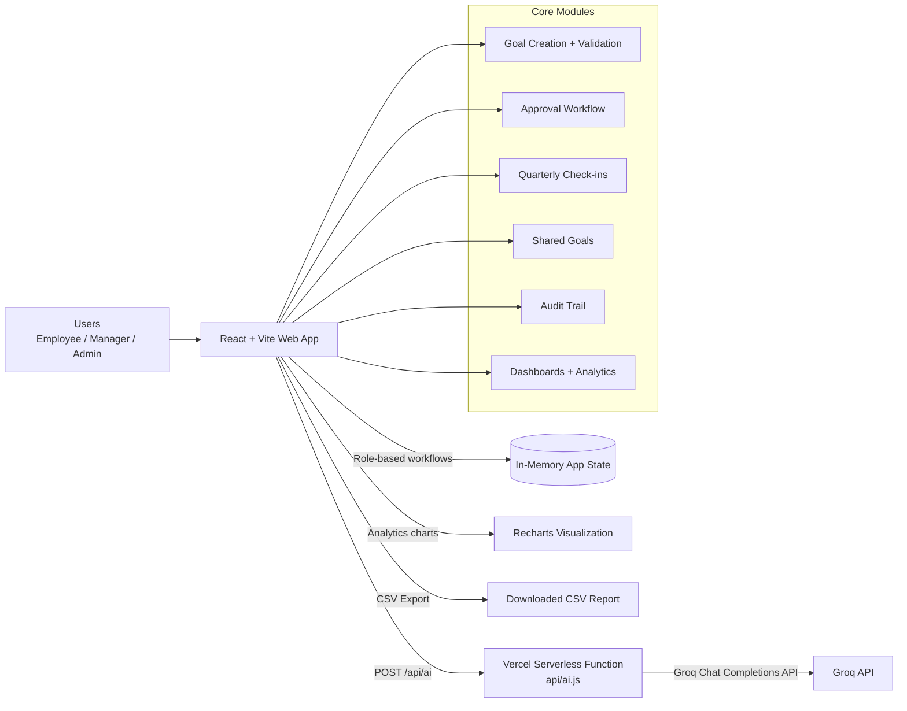

# AtomQuest Hackathon 1.0 Submission

## 1) Team / Project
- Project Name: NorthStar — In-House Goal Setting & Tracking Portal
- Hackathon: AtomQuest Hackathon 1.0
- Problem Statement: In-House Goal Setting & Tracking Portal

## 2) Live Demo
- Demo URL: [https://northstar-pw2wvlzcd-pooja-bishts-projects-fd1ed8ff.vercel.app/](https://northstar-pw2wvlzcd-pooja-bishts-projects-fd1ed8ff.vercel.app/)

## 3) Source Code Repository
- Repo URL: [https://github.com/poojabisht10/NorthStar](https://github.com/poojabisht10/NorthStar)
- Branch: `main`

## 4) Role-Based Login / Access
This app supports all 3 required personas with built-in role switching on login.

- Employee: Alice Johnson / Bob Kumar / Carol Singh / David Patel
- Manager (L1): Sarah Manager / James Lead
- Admin / HR: HR Admin

Note: Demo users can be selected directly from the login screen (no password required for hackathon demo).

## 5) Feature Coverage vs BRD

### Phase 1: Goal Creation & Approval (Must-Have)
- Employee goal sheet creation and submission
- Thrust Area + Goal Title + Description capture
- UoM support implemented (Min / Max / Timeline / Zero-based)
- Target + Weightage capture
- Validation rules enforced:
  - Total weightage must be 100%
  - Minimum weightage per goal is 10%
  - Maximum 8 goals per employee
- Manager L1 approval workflow:
  - Inline review/edit during approval
  - Return for rework
  - Approved goals lock behavior
- Shared goals:
  - Admin push shared goals to all/by department
  - Weightage editable for recipients
  - Shared-goal context retained in sheets

### Phase 2: Achievement Tracking & Quarterly Check-ins (Must-Have)
- Quarterly actual achievement updates per goal
- Status tracking: Not Started / On Track / Completed
- Manager check-in module with structured comments
- Planned vs Actual review per employee
- Computed progress logic integrated for tracking

### Check-in Schedule
- Quarterly windows represented in UI (Q1–Q4 + annual context)
- Role-based check-in actions and visibility enabled

## 6) Reporting & Governance
- Achievement export (CSV)
- Completion dashboards across personas
- Audit trail for key goal lifecycle changes

## 7) Good-to-Have Features Implemented
- Analytics module:
  - QoQ trend views
  - Heatmap/performance visuals
  - Goal distribution and status insights
- AI enhancements:
  - AI Goal Coach
  - AI Check-in Comment Generator
  - AI Insights Engine
- Escalation/alerts style signals in workflow

## 8) Tech Stack
- Frontend: React + Vite
- Styling: Custom CSS design system
- Charts: Recharts
- Backend/API proxy:
  - Vercel serverless function (`/api/ai`)
  - Groq API integration for AI features
- Deployment target: Vercel

## 9) Cost Optimization Notes
- Single-page app with lightweight serverless proxy
- API key kept server-side only
- Shared UI components reduce complexity and maintenance
- Efficient charting and local state flows for low infra overhead

## 10) Architecture Diagram

Reference file: `ARCHITECTURE.md`

## 11) Demo Script (Suggested for Judges)
1. Login as Employee and create/submit goals with validations.
2. Switch to Manager, review and approve/return goals, add check-in comment.
3. Switch to Admin, show org analytics, audit trail, and shared goal push.
4. Export achievement CSV and show end-to-end lifecycle completion.

## 12) Submission Checklist (Final)
- [x] Deployed URL added
- [x] GitHub repo URL added
- [x] Architecture diagram attached in this submission (`Mermaid`)
- [x] Role login/demo details verified
- [x] AI features verified with `GROQ_API_KEY`
